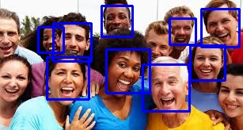

# Practice 2: Implementing face recognition using Functions-as-a-Service

This project is for the second task of the Cloud computing  course UGR.

## Features
- Face detection using OpenCV.
- Image processing and base64 encoding.

  

